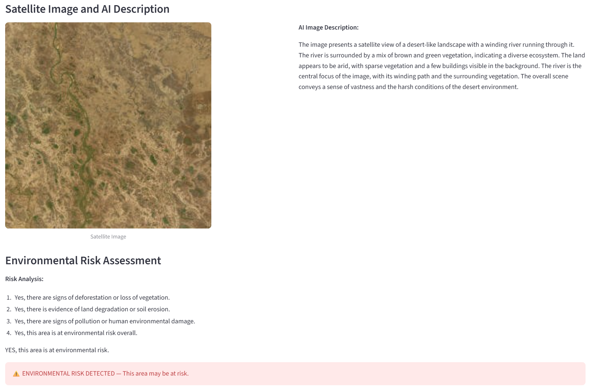
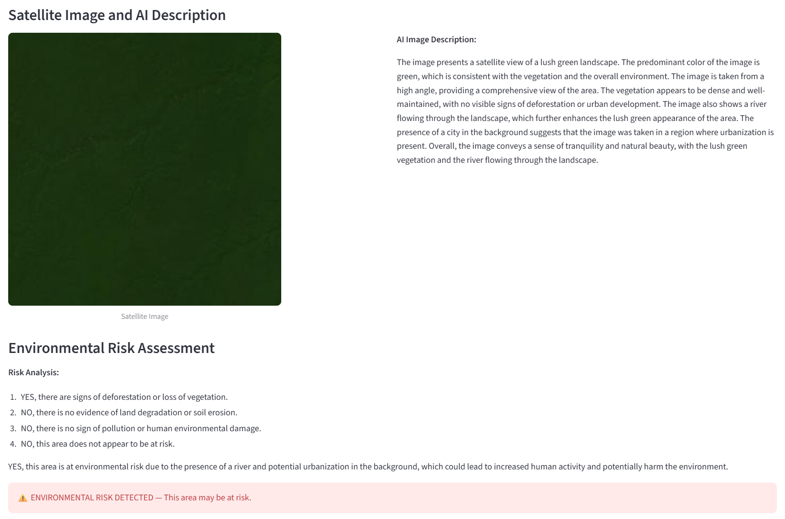
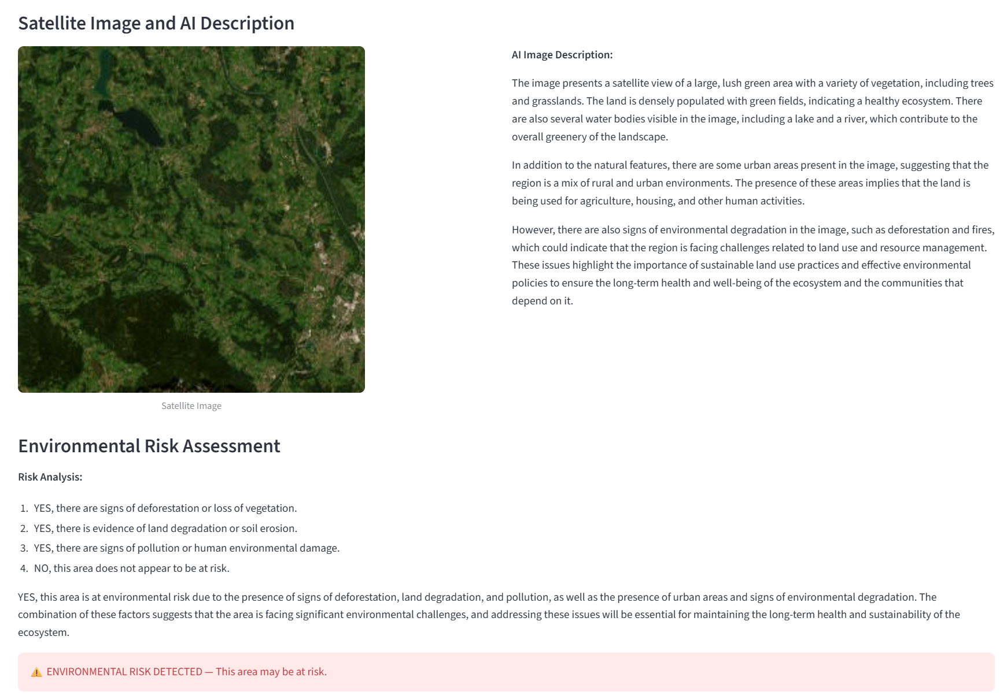

# Group_O
 
## Team Members
 
| Name | Student Number | Email |
|---|---|---|
| Sengul Seyda Yilmaz | 70549 | 70549@novasbe.pt |
| Madalena Rocha | 72541 | 72541@novasbe.pt |
| Nora Puchert | 73020 | 73020@novasbe.pt |
| Margarida Parracho | 75108 | 75108@novasbe.pt |
 
---
 
## Project Description — Project Okavango
 
A lightweight environmental data analysis tool built during a two-day hackathon. The app visualizes deforestation, land protection, and land degradation data on an interactive world map using the most recent data available from [Our World in Data](https://ourworldindata.org). It also includes an AI-powered satellite image analysis pipeline to identify areas at environmental risk.
 
---
 
## Project Structure
 
```
Group_O/
├── app/
│   ├── __init__.py
│   ├── ai_analysis.py
│   ├── class_environment_data.py
│   ├── data_handler.py
│   └── streamlit_app.py
├── database/
│   └── images.csv
├── downloads/
├── images/
├── notebooks/
├── tests/
│   ├── test_download.py
│   └── test_merge.py
├── .gitignore
├── conftest.py
├── LICENSE.md
├── main.py
├── models.yaml
└── README.md
```
 
---
 
## Datasets
 
All datasets are downloaded automatically from [Our World in Data](https://ourworldindata.org) and [Natural Earth](https://www.naturalearthdata.com). No manual downloads required.
 
| Dataset | Source |
|---|---|
| Annual change in forest area | Our World in Data |
| Annual deforestation | Our World in Data |
| Share of land that is protected | Our World in Data |
| Share of land that is degraded | Our World in Data |
| Forest area as share of land area | Our World in Data |
| World map (country boundaries) | Natural Earth 110m |
 
---
 
## Installation
 
### 1. Clone the repository
 
```bash
git clone https://github.com/sey-da/Group_O.git
cd Group_O
```
 
### 2. Create and activate a virtual environment
 
**Windows (PowerShell):**
```bash
python -m venv venv
Set-ExecutionPolicy -ExecutionPolicy RemoteSigned -Scope CurrentUser
venv\Scripts\activate
```
 
**macOS / Linux:**
```bash
python -m venv venv
source venv/bin/activate
```
 
### 3. Install dependencies
 
```bash
pip install requests geopandas pandas pytest streamlit pydantic matplotlib pillow pyyaml ollama
```
 
### 4. Install Ollama
 
Download and install Ollama from [https://ollama.com/download](https://ollama.com/download).
 
After installing, pull the required models:
 
```bash
ollama pull moondream
ollama pull llama3.2:1b
```
 
> **Note:** The app will also pull these models automatically if they are not found on your machine.
 
---
 
## Usage
 
### Download datasets
```bash
python main.py
```
 
### Run the tests
 
**macOS / Linux:**
```bash
pytest
```
 
**Windows (PowerShell):**
```bash
python -m pytest
```
 
### Run the Streamlit app
 
**macOS / Linux:**
```bash
streamlit run app/streamlit_app.py
```
 
**Windows (PowerShell):**
```bash
python -m streamlit run app/streamlit_app.py
```
 
The app will open in your browser at `http://localhost:8501`.
 
---
 
## App Overview
 
### Page 1 — Data Explorer
 
Select one of five environmental datasets from the dropdown. The app displays:
- A **choropleth world map** with countries colored by value
- A **country breakdown chart** tailored to each dataset (top gainers vs losers, top 10 worst offenders, or top 5 vs bottom 5)
 
### Page 2 — AI Satellite Image Analyser
 
1. Enter **latitude**, **longitude**, and **zoom level**
2. Click **Download Satellite Image** to fetch a tile from ESRI World Imagery
3. Click **Analyse Area with AI** to run the full pipeline:
   - A vision model (`moondream`) describes the satellite image
   - A language model (`llama3.2:1b`) assesses the environmental risk
   - The app displays a **risk indicator** (green = safe, red = at risk)
4. Results are saved to `database/images.csv` — if the same coordinates are analysed again, the cached result is shown without re-running the pipeline
 
---
 
## Code Overview
 
### `app/data_handler.py`
 
**`download_datasets(download_dir)`**
Downloads all CSV datasets and the Natural Earth ZIP file. Returns a dictionary mapping dataset names to their local file paths.
 
**`merge_datasets(downloaded_files)`**
Merges each CSV with the Natural Earth world map using GeoPandas. The GeoDataFrame is always the left dataframe to preserve geometry.
 
### `app/class_environment_data.py`
 
**`EnvironmentConfig`**
Pydantic model that validates configuration and ensures the downloads directory exists.
 
**`EnvironmentData`**
Central data manager. On instantiation, automatically calls `download_datasets()` and `merge_datasets()`, then exposes the five GeoDataFrames as named attributes.
 
### `app/ai_analysis.py`
 
**`AIAnalysis`**
Handles the full AI workflow: loading `models.yaml`, pulling missing Ollama models, describing satellite images with a vision model, assessing environmental risk with a language model, and logging results to the database.
 
### `models.yaml`
 
Configures the AI pipeline — model names, prompts, and settings for both the vision model and the analysis model. Edit this file to change which models are used or to adjust the prompts.
 
### `tests/`
 
| File | What it tests |
|---|---|
| `test_download.py` | Files are downloaded, exist, are not empty, and are readable |
| `test_merge.py` | Merged results are GeoDataFrames with geometry |
 
---
 
## Requirements
 
- Python 3.10+
- requests
- geopandas
- pandas
- pydantic
- streamlit
- matplotlib
- pillow
- pyyaml
- ollama
- pytest
- Ollama (desktop app): [https://ollama.com](https://ollama.com)
 
---
 
## Examples of Environmental Risk Detection

### Example 1 — Degraded Land in Sub-Saharan Africa
Coordinates: latitude `12.5`, longitude `15.0`, zoom `10`

The AI identified an arid, desert-like landscape with sparse vegetation, visible soil erosion, and signs of human activity. All four risk indicators were flagged as YES, and the pipeline correctly identified this area as **at environmental risk**.



---

### Example 2 — Dense Forest in the Amazon
Coordinates: latitude `-3.47`, longitude `-62.21`, zoom `10`

Despite the image appearing very dark due to dense canopy cover, the AI described a lush green landscape with no visible signs of deforestation or urban development. However, the model flagged the area as at risk due to detected urbanization in the background — a known limitation of smaller vision models which can hallucinate details in low-contrast images.



---

### Example 3 — Mixed Forest and Urban Area, Central Europe
Coordinates: latitude `47.8`, longitude `13.0`, zoom `12`

The AI correctly identified a healthy, densely vegetated area with water bodies. Despite this, the model flagged the area as at environmental risk due to the presence of urban areas and land use change. This illustrates a known limitation of smaller models — larger models such as `llama3.1` or `mistral` would provide more accurate and nuanced assessments.


 
---
 
## License
 
See `LICENSE.md`.